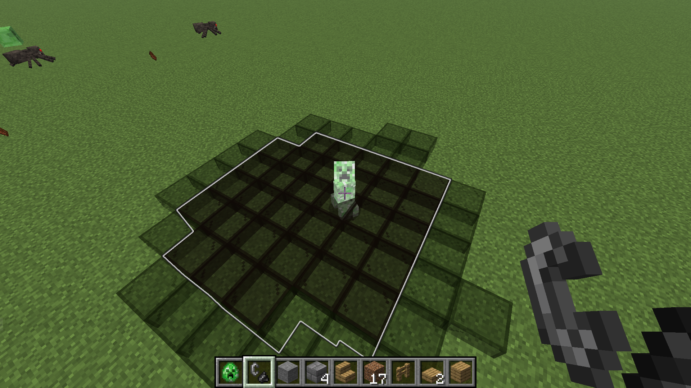
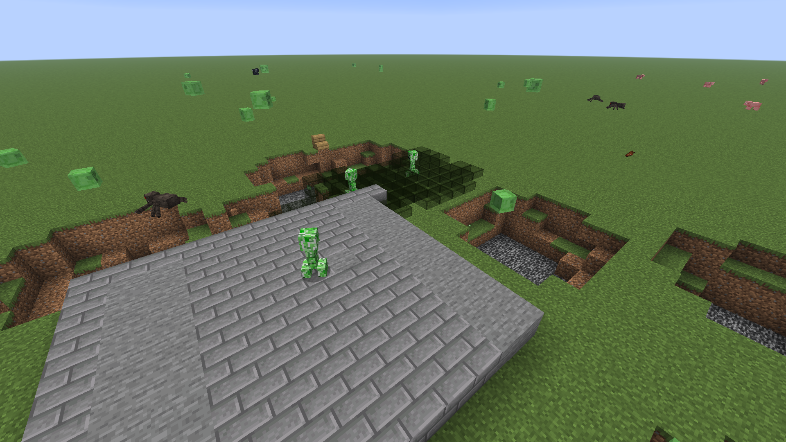
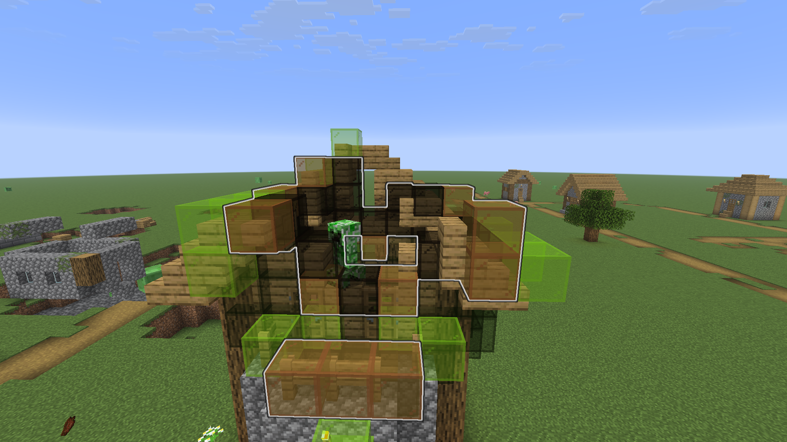
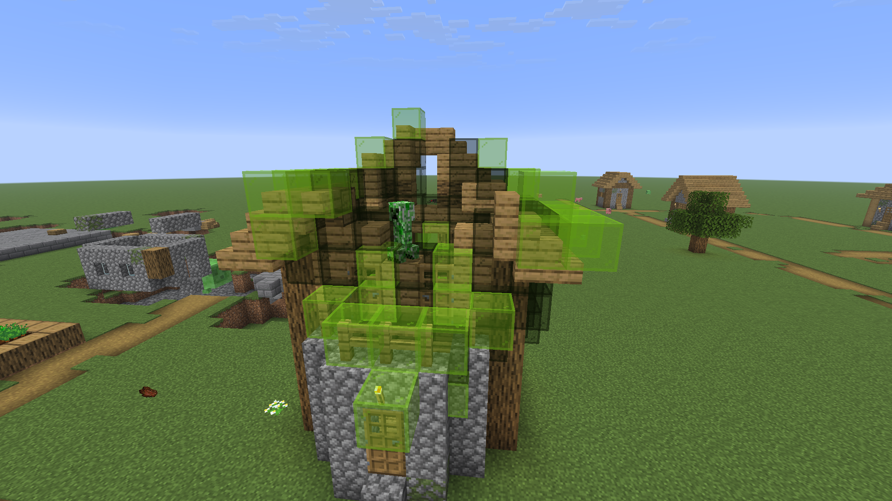

# Dano Realista da Explosão do Creeper

Mod Fabric para Minecraft 1.21.11 que torna explosões de creeper "mais realistas" na minha opinião:
blocos resistentes ficam imunes e blocos frágeis quebram com mais facilidade e em distância maior.

## Recursos
- Imunidade para blocos resistentes (blast resistance >= 6) e blocos da tag `creeper_immune`.
- Fragilidade extra para blocos frágeis (lã, madeira, etc), vidro e terra.
- Alcance levemente aumentado nas explosões de creeper.
- Visualização em tempo real para todos os creepers na visão do jogador.

## Requisitos
- Java 21
- Fabric Loader 0.18.4+
- Fabric API (0.140.2+1.21.11 ou compativel)

## Executar em Ambiente de Desenvolvimento
No Windows (PowerShell):
```powershell
.\gradlew runClient
```

## Compilar
No Windows (PowerShell):
```powershell
.\gradlew build
```

O jar gerado fica em:
```
build/libs/creeper-realistic-explosion-damage-<versao>.jar
```

## Executar Testes
Para rodar os testes unitários:
```powershell
.\gradlew test
```

O relatório de testes fica em:
```
build/reports/tests/test/index.html
```

## Instalar no Jogo
1) Instale o Fabric Loader 1.21.11.
2) Baixe e coloque o Fabric API na pasta `mods`.
3) Coloque o jar do mod na pasta `mods`.

## Comandos
- `/creeperpreview`  
  Liga ou desliga a visualização em tempo real.

A visualização usa vermelho vivo (ou preto) para o efeito vanilla (mostrado desde o início do fuse) e verde para o efeito atual.
Blocos imunes não recebem visualização.
Se quiser mudar as cores, edite `PREVIEW_VANILLA` e `PREVIEW_CURRENT` em `src/main/java/com/fhfelipefh/preview/CreeperPreviewManager.java`.

## Personalização de Tags
Você pode ajustar quais blocos são imunes ou mais frágeis:
- `src/main/resources/data/creeper-realistic-explosion-damage/tags/blocks/creeper_immune.json`
- `src/main/resources/data/creeper-realistic-explosion-damage/tags/blocks/creeper_fragile.json`

## Imagens




